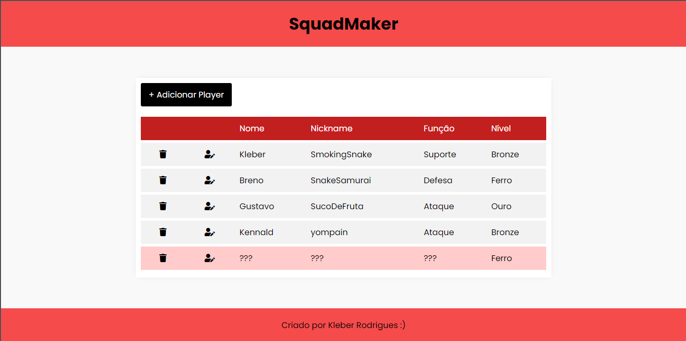
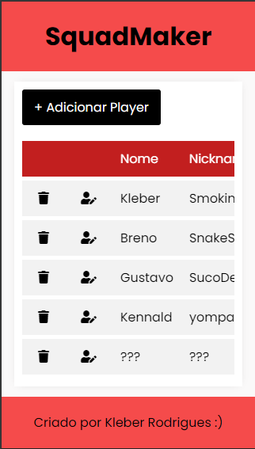

# SquadMaker

Aplicação (completamente RESPONSIVA) do tipo CRUD através do acesso ao Local Storage do navegador. O objetivo da aplicação é cadastrar membros para um squad no jogo de fps Valorant (ou qualquer outro que queira). 

## Algumas observações
- Os dados cadastrados permanecerão cadastrados desde que a página seja acessada com o mesmo navegador, no mesmo dispositivo.

## Visualize o projeto
https://kleberjr.github.io/squadmaker/

## Tecnologias utilizadas:
- HTML5
- CSS3
- JavaScript
- Git
- Github
